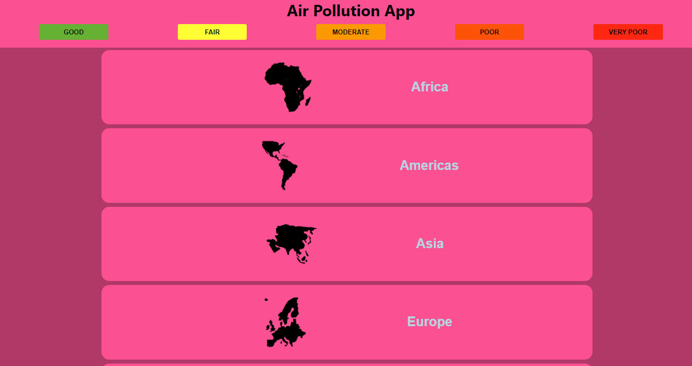
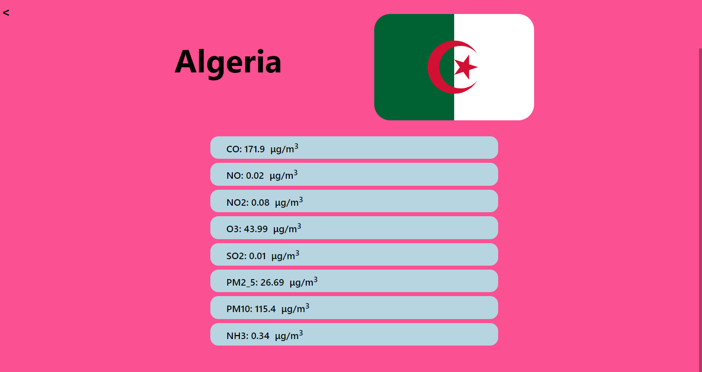

<a name="readme-top"></a>


# 📗 Table of Contents

- [📖 About the Project](#about-project)
  - [🛠 Built With](#built-with)
    - [Tech Stack](#tech-stack)
    - [Key Features](#key-features)
  - [🚀 Live Demo](#live-demo)
- [💻 Getting Started](#getting-started)
  - [Setup](#setup)
  - [Prerequisites](#prerequisites)
  - [Install](#install)
  - [Usage](#usage)
  - [Run tests](#run-tests)
  - [Deployment](#triangular_flag_on_post-deployment)
- [👥 Authors](#authors)
- [🔭 Future Features](#future-features)
- [🤝 Contributing](#contributing)
- [⭐️ Show your support](#support)
- [🙏 Acknowledgements](#acknowledgements)
- [❓ FAQ](#faq)
- [📝 License](#license)

# 📖 [Air Pollution App] <a name="about-project"></a>

**Air Pollution** is a web app that tracks Air Quality worldwide. It uses the Air Pollution API from Open Weather Map

## 📷 [Screenshots]

<div>
  
  
</div>

## 🛠 Built With <a name="built-with"></a>

### Tech Stack <a name="tech-stack"></a>

<details>
  <summary>Client</summary>
  <ul>
    <li><a href="https://reactjs.org/">React.js</a></li>
    <li><a href="https://redux.js.org/">Redux</a></li>
    <li><a href="https://axios-http.com/docs/intro">Axios</a></li>
  </ul>
</details>

### Key Features <a name="key-features"></a>

- **[Homepage - Dispalys 5 major continents]**
- **[Countries - Displays data for each continent]**
- **[Details - Displays air quality data for each country]**

<p align="right">(<a href="#readme-top">back to top</a>)</p>

## 🚀 Live Demo <a name="live-demo"></a>

- [Live Demo Link](https://khaled-alkhateeb.github.io/airpollution-capstone/)

<p align="right">(<a href="#readme-top">back to top</a>)</p>

## 🎥 Video Presentation
- [Video](https://www.loom.com/share/dcde415dbf614fdaaa3ffba0b3533fa6)

<p align="right">(<a href="#readme-top">back to top</a>)</p>

## 💻 Getting Started <a name="getting-started"></a>

To get a local copy up and running, follow these steps.

### Prerequisites

In order to run this project you need:

- Latest version of [Node](https://nodejs.org/en/) installed on the computer.
- [Git](https://git-scm.com/downloads) installed on the computer.

### Setup

Clone this repository to your desired folder:

```sh
  cd my-folder
  git clone git@github.com:myaccount/my-project.git
```

### Install

Install this project with:

```sh
  cd my-project
  npm install
```

### Usage

To run the project, execute the following command:

```sh
  npm start
```

### Run tests

To run tests, run the following command:

```sh
  npm test
```

### Deployment

You can deploy this project using:

- [Vercel](https://vercel.com/docs)

<p align="right">(<a href="#readme-top">back to top</a>)</p>

## 👥 Author <a name="author"></a>

👤 **Khaled Al-Khateeb**

- GitHub: [@Khaled-AlKhateeb](https://github.com/Khaled-AlKhateeb)
- Twitter: [@KhaledA93751489](https://twitter.com/KhaledA93751489)
- LinkedIn: [khaled-al-khateeb](https://www.linkedin.com/in/khaled-al-khateeb-3a1013247/)

<p align="right">(<a href="#readme-top">back to top</a>)</p>

## 🔭 Future Features <a name="future-features"></a>

- [ ] **[Add Search Feature]**

<p align="right">(<a href="#readme-top">back to top</a>)</p>

## 🤝 Contributing <a name="contributing"></a>

Contributions, issues, and feature requests are welcome!

Feel free to check the [issues page](https://github.com/Khaled-AlKhateeb/airpollution-capstone/issues).

<p align="right">(<a href="#readme-top">back to top</a>)</p>

## ⭐️ Show your support <a name="support"></a>

If you like this project, give it a ⭐

<p align="right">(<a href="#readme-top">back to top</a>)</p>

## 🙏 Acknowledgments <a name="acknowledgements"></a>

I would like to thank

- [Microverse](https://www.microverse.org/)
- [Nelson Sakwa on Behance](https://www.behance.net/sakwadesignstudio)
- [Open Weather](https://openweathermap.org/)

<p align="right">(<a href="#readme-top">back to top</a>)</p>

## 📝 License <a name="license"></a>

This project is [MIT](./LICENSE) licensed.

<p align="right">(<a href="#readme-top">back to top</a>)</p>